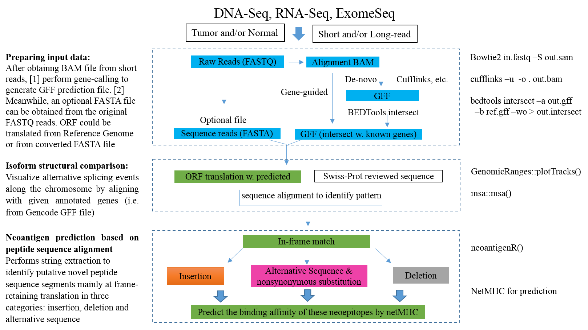

<!--
%% \VignetteEngine{knitr::rmarkdown}
%\VignetteIndexEntry{neoantigeR}
-->


# Introduction to neoantigeR

## Authors and Affliations

Shaojun Tang#, Subha Madhavan

1. Innovation Center for Biomedical Informatics, Georgetown University Medical Center, Washington, DC, United States of America,

2  Department of Oncology, Georgetown University Medical Center, Washington, DC, United States of America,

## Abstract

It has been reported that greater than 90% of human genes are alternative spliced, suggesting a challenging complexity of the transcriptome reconstruction. An analysis of splicing complexity by gene size has indicated that the combination potential for exon splicing can increase exponentially. Current studies showed that the number of transcripts reported to date may be limited by the short-read sequencing due to the transcript reconstruction algorithms, whereas long-read sequencing is able to significantly improve the detection of alternative splicing variants since there is no need to assemble transcripts from short reads. 

## Introduction

Our neoantigen prediction pipeline requires a very widely used standard data input from next-generation sequencing assays. In the simplest nontrivial scenario, the pipeline only needs a gene prediction output file in GFF format. Our pipeline will use the input GFF file to extract ORFs from the predicted isoforms and compared them with reference protein database typically from Uniprot Swiss-Prot. If the sequencing data is from third-generation long read sequencing, the input files may consist the gene prediction file in GFF format, and a sequence file. 


neoantigeR provides several


# Installing neoantigeR

neoantigeR should be installed as follows:

```{r eval=FALSE}

```


# preparing sequencing data for neoantigen characterization by neoantigeR

neoantigeR is very usefriendly. Users only need to provide a 'Tab' delimited
 input data file and give the indexes of control and case samples.

## Reading the input data:

Read Inupt Data to R . As described above, our pipeline relies on input generated from the analysis of high-throughput parallel sequencing data including short-read RNA-Seq or long-read PacBio SMRT sequencing data. Generally, these data can be easily obtained from existing aligning and gene calling tools. Here, we outline an example preparatory steps to generate these input data.

Reference genome sequence alignment was performed using the Bowtie2 [Ref] for aligning of original raw sequences (FASTQ files) to obtain SAM/BAM files. In brief, Bowtie (version 2.1) [22] was used for alignment with default parameters. The resulting alignments (in BAM format) file was subsequently used as input to the gene calling tool Cufflinks [Ref] in de-novo gene-finding mode (no gene annotation is provided) with default parameters. Cufflinks accepted aligned RNA-Seq reads (SAM/BAM format) and assembled the alignments into a parsimonious set of transcripts. A transcript annotation file in GFF format was produced. 




# Running neoantigenR

## provide the input files and setup the enviornment

The samples are normalized to have the same library size (i.e. total raw read counts) if the experiment replicates were obtained by the same protocol and an equal library size was expected within each experimental condition. The neoantigeR will apply the sum normalization so that each column has equal value by summing all the genes of each replicate.

```{r}
	source("../R/neoantigenR.R")

	protein.database.file.name		   =	"../inst/extdata/swissuniprots.fasta"
	reference.gff.file						   =	"../inst/extdata/gencode.v19.annotation.gff3"
	pacbio.gff							         =	"../inst/extdata/model.gff"
	pacbio.gencode.overlapping.file	 =	"../inst/extdata/bedtool.intersect.overlaps.txt"
	output.folder					         	 =	"../inst/extdata/"

	file.exists(pacbio.gff)
	print(pacbio.gff)
	
	org="hg19"
	
```


## neoantigeR analysis with long read sequencing data

* A dataset containing the full-length whole transcriptome from three diverse human tissues (brain, heart, and liver) was directly downloaded from the PacBio official website [Ref]. 

* This dataset is ideal for exploring differential alternative splicing events.


```{r}

	neoantigenR.initialize()
	neoantigenR.get.Model()
	neoantigenR.get.peptides()
	neoantigenR.write()

```


## Printting sample neoantigen precursor candidates

```{r}
 library(knitr)
 kable(head(alignment.indel.detailed.info.table,10), caption = "The top 10 records for neoantigens")
```

* As neoantigeR is coded using object oritented programming, all computations are
based on object manipulation.


# Theory behind neoantigeR

In RNA-Seq transcriptome data, it common to observe thousands of alternative isoforms sequence that are novel transcribed regions or variants of existing genes, however, the majority of these isoforms will result in significantly truncated proteins or sequences interrupted by many stop codons when performing in-silico translation. It’s important to survey the fraction of these isoforms that will produce peptide sequence highly similar to reference proteins with meaningful sequence alternations.
